# 中級編 準備ガイド

このドキュメントでは、**GitHub Copilot 中級者編ハンズオン**（`中級者編.md`）を実施するために必要な環境と前提条件を説明します。

---

## 前提条件

- VS Code がインストールされていること
- [Dev Containers 拡張機能](https://marketplace.visualstudio.com/items?itemName=ms-vscode-remote.remote-containers) がインストールされていること
- Dockerが動作していること
- GitHub アカウントを持ち、GitHub Copilot のライセンスが有効であること

---

## VS Codeのインストール
VS Code をインストールしていない場合は、以下のリンクからダウンロードしてインストールしてください：
- [Visual Studio Code ダウンロードページ](https://code.visualstudio.com/download)

VS Code のインストールが完了したら、GitHub Copilotを使用できるようにします。

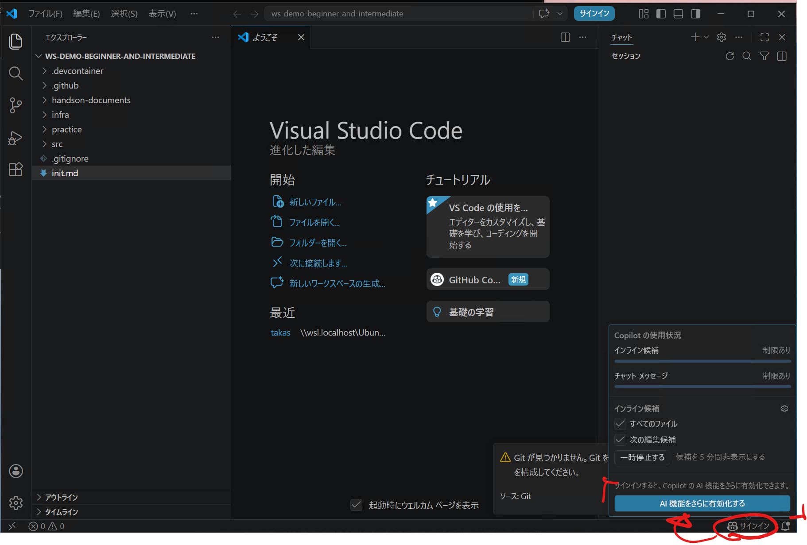

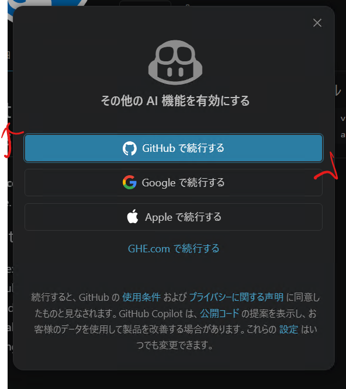

貴社Enterpriseから払い出されたアカウントを指定すればSSOでログインができるようになります。

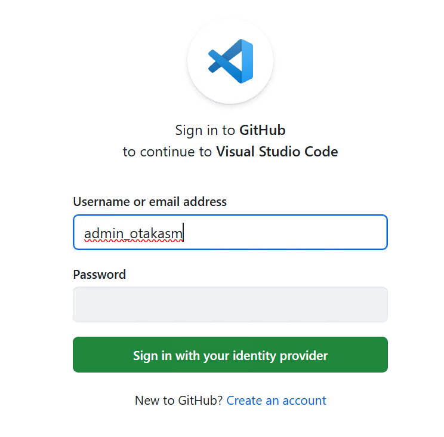

## VS CodeでGitHubのログインを行う
VS Code を起動し、左下のアカウントアイコンをクリックして、GitHub アカウントでサインインします。
これにより、VS Code 内で GitHub Copilot を使用するための認証が完了します。

## WSLの準備(Windowsのみ)

Windows を使用している場合は、WSL（Windows Subsystem for Linux）をインストールしておくことを推奨します。DevContainer は WSL 上で動作させるのが最もスムーズです。
管理者権限で PowerShell を開き、以下のコマンドを実行して WSL をインストールします：

```powershell
wsl --install
```

WSLのインストールが完了したら再起動を行います。
再度下記を実行することでUbuntuがインストールされます。

```powershell
wsl --install
```

Ubuntu実行後、ユーザー名とパスワードの設定を行います。

WSL のインストール方法の詳細は以下の Microsoft ドキュメントを参照してください：
- [Windows 10/11 に WSL をインストールする](https://docs.microsoft.com/ja-jp/windows/wsl/install)

## GitHub Copilot CLIのインストール

`wget -qO- https://gh.io/copilot-install | bash` を実行して、GitHub Copilot CLI をインストールします。
インストール後、画面を閉じて再度開くと、GitHub Copilot CLI が使用できる状態になります。
スタート画面にUbuntuが追加されているので、そこから起動してください。

スタート画面からUbuntuを選択するか、Windows TeminalでUbuntuを選択することができます

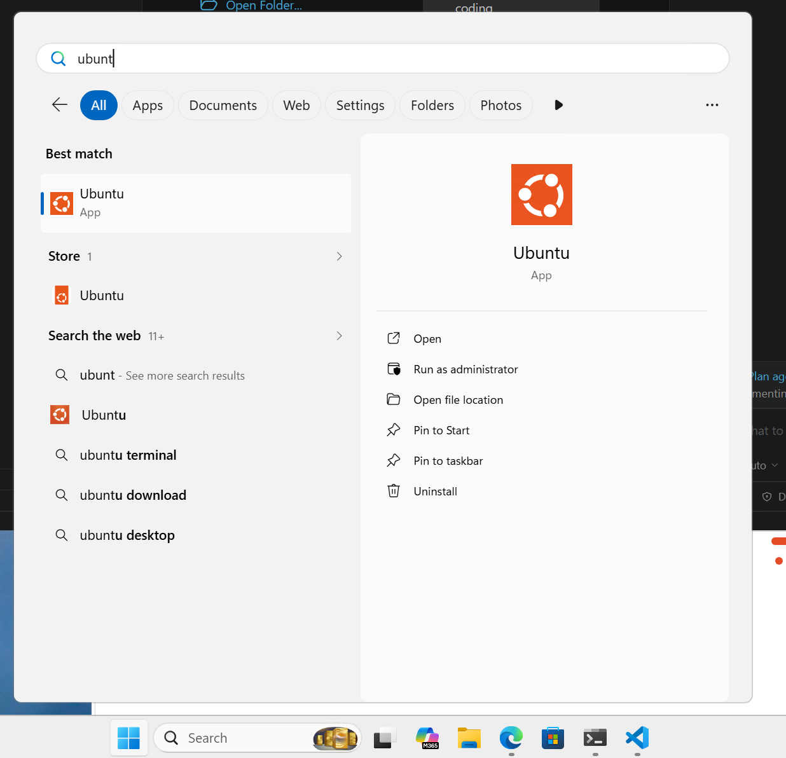

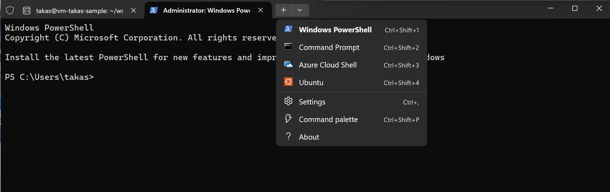

`copilot` コマンドを実行して、GitHub Copilot CLI が正しくインストールされていることを確認します。
Copilot CLIが正常に動作していたら `/login` コマンドを実行して、GitHubアカウントでログインしてください。

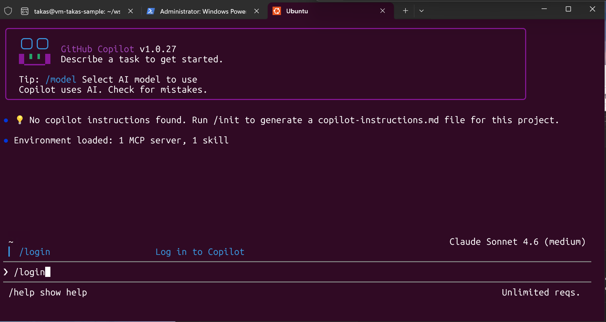

使用できる状態になったら下記の確認をGitHub Copilot CLIに行い、必要な諸々の環境のセットアップを手伝ってもらってください。

``` markdown
現在活動しているWSLの環境の中で下記を使用したいからセットアップしてください
- DevContainer
- Git
```

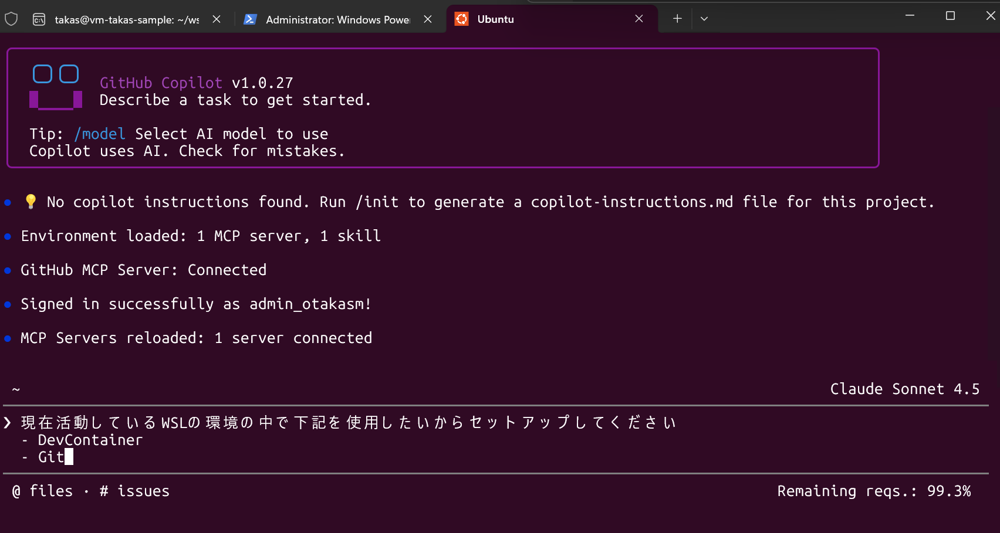

## ソースコードの取得とDevContainer起動の確認

`Ctrl+C`を複数回押して、Copilot CLIの対話モードを終了します。
Ubuntu上で、以下のコマンドを実行して、ハンズオンで使用するソースコードをクローンします：

```bash
git clone https://github.com/Takas0522/ws-demo-beginner-and-intermediate.git && git switch origin/feature/middle
```

その後下記のコマンドを実行しVS Codeで開きます。

```bash
cd ws-demo-beginner-and-intermediate && code .
```

VS Codeでプロジェクトが開いたら、DevContainerの設定を行います。

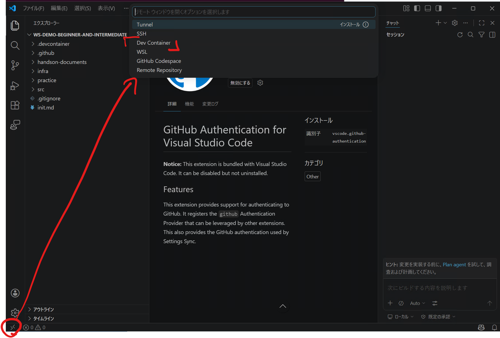

DevContainerの設定が完了したら、VS Code の左下に「Dev Container: Reopen in Container」という表示が出るので、クリックして Dev Container 内でプロジェクトを開きます。
または下図の手順でも同様にDev Container内でプロジェクトを開くことができます。

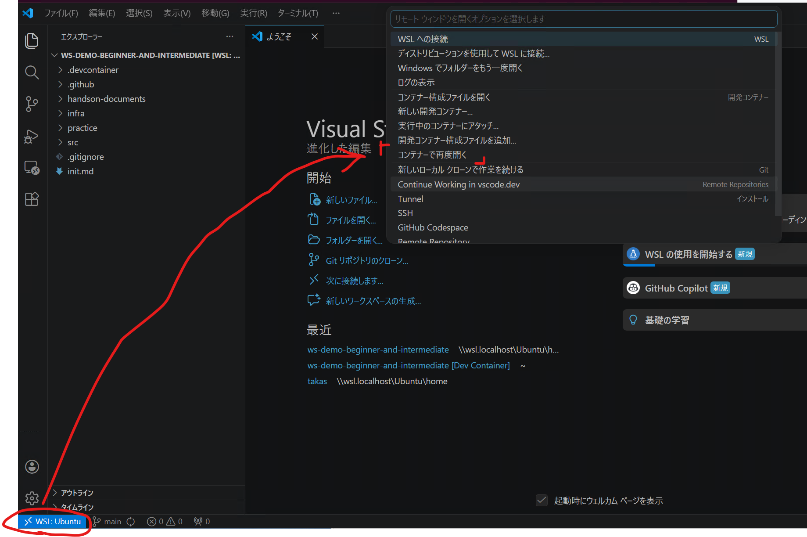

## DevContainer内での確認

VS Codeのターミナルを開きます。
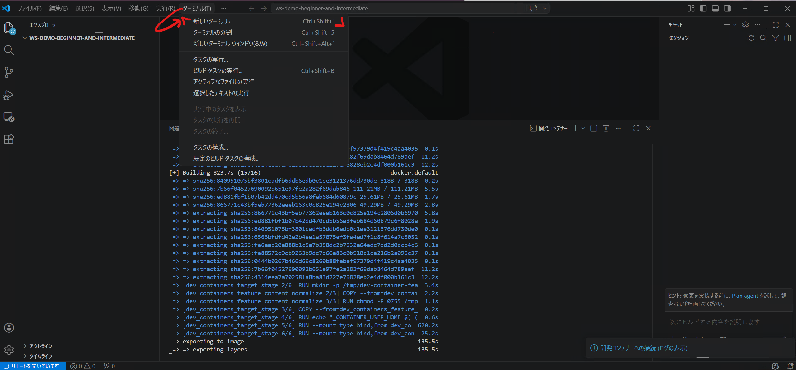

以下のコマンドを実行して、必要なツールが正しくインストールされていることを確認します

``` bash
dotnet --version && node --version && playwright-cli --version && gh --version && copilot --version
```
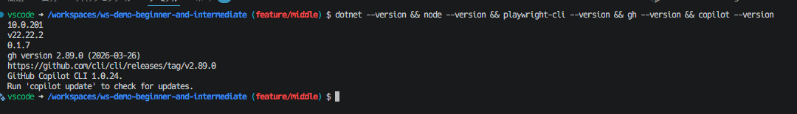

新しい仮想マシン上で動くことになるため、GitHub Copilot CLIのログインが必要になります。以下のコマンドをCopilot CLIで実行して起動してください。

``` bash
copilot
```

Copilot CLI上で `/login` でログインをして使用できる状態になったら完了です。

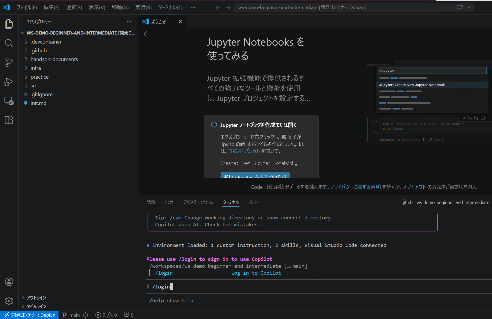

