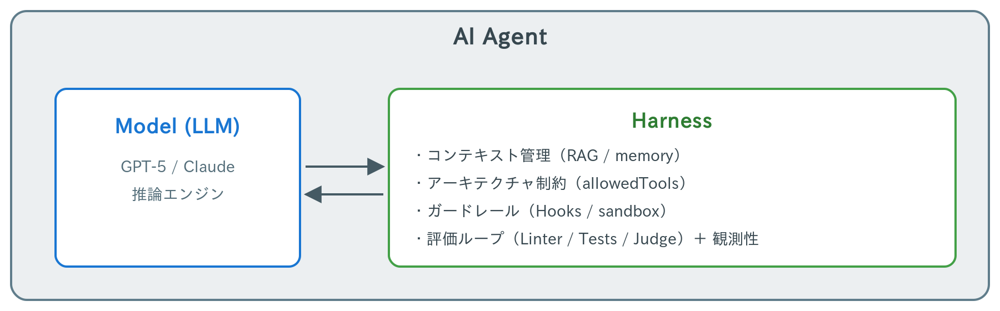
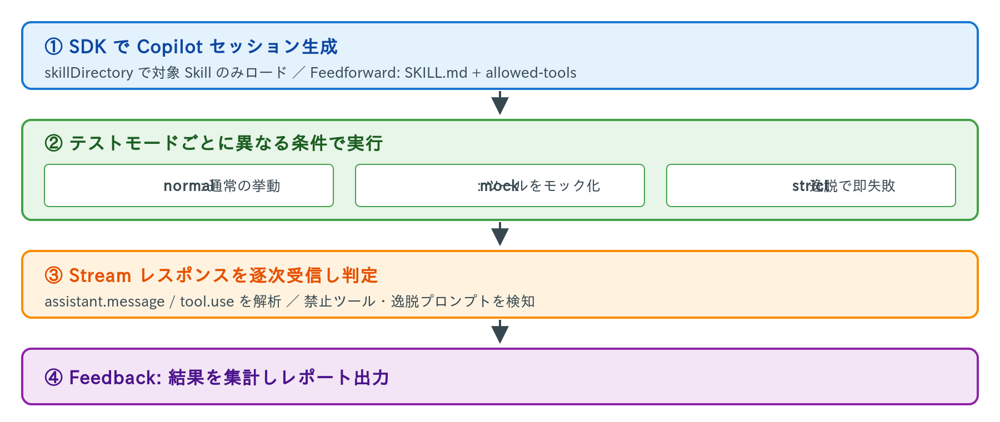
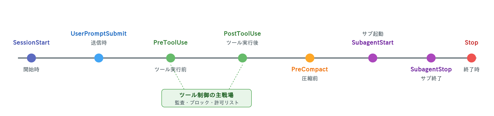

<!-- _class: intro -->

# GitHub Copilot 中級者編

ハンズオン資料 — 作業の高度な自動化と ハーネスエンジニアリングの実践

---

<!-- _class: intro -->

## 前回の振り返り

1. GitHub EnterpriseとGitHub Copilot
2. 基本操作と最初の会話と設定
3. コードや文章の補完とAgentモードの活用
4. GitHub Copilotのカスタマイズ
5. CLIでのGitHub Copilotの活用
6. 業務での活用1(ブラウザ操作の自動化)
7. 業務での活用2(調査とレポートの作成)

---

<!-- _class: intro -->

# 前回アンケートの振り返り

- ハンズオンを受けて社内で活用したい・挑戦したいこと項目のまとめ
  - Skill/Agent の作成・活用（最多：9件）
  - コード関連作業の効率化（6件）
  - ドキュメント・資料作成（4件）
  - ツール連携・新技術への挑戦（3件）
  - 学習・スキルアップ意欲（2件）


---

<!-- _class: intro -->

# 🗂️ 本日のアジェンダ

<div style="display: grid; grid-template-columns: 1fr 1fr; gap: 0.8rem; font-size: 18px;">
<div>

### 0. 最新アップデートまとめ（2026/01〜04）
### 1️. ハーネスエンジニアリングとは
### 2️. 調査対象アプリケーションの起動
### 3️. Playwright CLI による Web アプリ分析
### 4️. 自動化と制限・制御の実装
### 5️. GitHub Copilot SDK を使用した作業のバッチ化
### 6️. ダッシュボードアプリの作成
### 7️. 今後の発展

</div>
<div>


---

### 🎯 本日のゴール
- エージェントを「道具」ではなく**運用システム**として設計できる
- Feedforward / Feedback のループを自分の開発環境で構築できる
- CLI / SDK / Hooks を組み合わせた**再現性のある自動化**を体験する

---

<!-- _class: update -->

# 📣 最新アップデートまとめ（2026/01〜04）

GitHub Changelog / GitHub Copilot CLI / Visual Studio Code の3ソースから、
**中級者編に入る前に押さえておきたい直近4か月の変化**を整理します。

- **重要トピック**: 1スライド1件でじっくり確認
- **その他の更新**: 2段組で月次/カテゴリ別にまとめて俯瞰

> 凡例: 🔴 極大 / 🟠 大 / 🟡 中 / 🟢 小　（重要度・影響度の主観的評価）

情報源: [GitHub Changelog](https://github.blog/changelog/) ／ [github/copilot-cli Releases](https://github.com/github/copilot-cli/releases) ／ [VS Code Updates](https://code.visualstudio.com/updates)

---

<!-- _class: update -->

# 🥇 Copilot CLI が一般提供（GA）

**更新日**: 2026-02-25 ／ **重要度** 🔴 極大 ／ **影響度** 🔴 極大

- ターミナル上で動く Copilot エージェントランタイムが、すべての Copilot プラン（Pro / Pro+ / Business / Enterprise）で GA。
- Plan mode、Autopilot、MCP・Plugin・Skill・Hook の4軸拡張、GPT-5 系・Claude Sonnet/Opus 系の**マルチモデル選択**を標準搭載。
- Enterprise では同時展開された **AI Controls / Agent Control Plane** でモデル可用性・Autopilot 可否・Plugin allowlist を中央管理できる。

**要点**
1. プレビュー1年を経て、全 Copilot プランにターミナル版エージェントが解禁。
2. Plan → Autopilot → Critic の**多段エージェント運用**が CLI 1本で完結。
3. エンタープライズは AI Controls で**ガバナンス付き利用**が可能。

🔗 https://github.blog/changelog/2026-02-25-github-copilot-cli-is-now-generally-available/

---

<!-- _class: update -->

# 🥈 VS Code v1.111: Autopilot & 週次リリース化

**更新日**: 2026-03-09 ／ **重要度** 🔴 極大 ／ **影響度** 🔴 極大

- VS Code がこのリリースから **月次 → 週次 Stable** へ移行。エージェント機能の高速イテレーションが可能に。
- チャットビューに **パーミッション・ピッカー（Default / Bypass / Autopilot）** を導入。
- **Autopilot（Preview）** は `task_complete` が呼ばれるまでエージェントが自律反復。`chat.autopilot.enabled` で Stable でも試用可能。
- `.agent.md` frontmatter に **agent-scoped hooks** が書けるようになり、`#debugEventsSnapshot` でデバッグ情報をコンテキスト添付可能。

**要点**
1. VS Code が**週次リリース**に移行し、エージェント体験の変化速度が桁違いに。
2. **Autopilot** でエージェントが完了判断まで自走する運用が現実に。
3. エージェント単位の **hooks** と**デバッグスナップショット**で観測性/拡張性が同時向上。

🔗 https://code.visualstudio.com/updates/v1_111

---

<!-- _class: update -->

# 🥉 VS Code v1.116: Copilot が built-in に

**更新日**: 2026-04-15 ／ **重要度** 🔴 極大 ／ **影響度** 🔴 極大

- **GitHub Copilot が VS Code に標準組み込み**。`GitHub Copilot Chat` 拡張をインストールしなくても AI 利用を開始可能。
- **Agent Debug Logs が永続化**され、過去セッションのイベントログをローカルディスクから参照可能に（`github.copilot.chat.agentDebugLog.fileLogging.enabled`）。
- **Copilot CLI の thinking effort** が VS Code のモデルピッカーから直接調整可能。
- **Terminal agent tools** で任意のターミナルセッションへエージェントがアクセス可能。Tool confirmation carousel で複数ツール呼び出しを一括承認。

**要点**
1. Copilot の**初期導入フリクションが消滅**。新規開発者のオンボーディングが大幅改善。
2. 過去セッションの**事後デバッグ**が可能に（いつ・何が起きたかを再現可）。
3. CLI/ローカル/ターミナルの**ツール呼び出しが一貫した UX** で扱えるように。

🔗 https://code.visualstudio.com/updates/v1_116

---

<!-- _class: update -->

# 🔐 Copilot データレジデンシー & FedRAMP Moderate

**更新日**: 2026-04-13 ／ **重要度** 🔴 極大 ／ **影響度** 🔴 極大（規制業界・公共）

- Copilot のデータ処理を **US / EU 境界内**に留める **データレジデンシー** が利用可能に。
- US 政府向けに **FedRAMP Moderate** 認可を取得。規制下で導入できなかった業種（金融 / 医療 / 公共）で解禁。
- ほぼ全機能、主要モデルが対応。レジデンシー経路の処理には **わずかなプレミアム課金**。

**要点**
1. これまで Copilot 導入に踏み切れなかった **規制業界・官公庁** がカバーされた。
2. ほぼ全機能・主要モデルが**レジデンシー境界内**で利用可能。
3. コスト面では**プレミアム課金**あり。採用前にモデル/機能ごとの料金確認が必要。

🔗 https://github.blog/changelog/2026-04-13-copilot-data-residency-in-us-eu-and-fedramp-compliance-now-available/

---

<!-- _class: update -->

# 🌐 Copilot CLI のリモート制御（Web / Mobile）

**更新日**: 2026-04-13 ／ **重要度** 🔴 極大 ／ **影響度** 🟠 大

- ローカルで動作中の Copilot CLI セッションを **Web・モバイルから監視 / 操縦**できる Public Preview。
- CLI 側は `--remote` / `/remote`、GitHub.com の **Agents タブ** から該当セッションに接続し、指示送信や出力確認が可能。
- 2026-01 の Agents タブ新設 → 04 の CLI リモート制御で、**CLI がバックエンド・Web/Mobile がフロントエンド**というアーキテクチャが整った。

**要点**
1. 離席中・移動中でも**長時間エージェント作業をモバイルから舵取り**可能。
2. Agents タブが**マルチデバイス・マルチセッションのハブ**として機能。
3. ハーネス設計の観点では、**CLI = 実行主体 / Web = 操縦席**という役割分離が前提に。

🔗 https://github.blog/changelog/2026-04-13-remote-control-cli-sessions-on-web-and-mobile-in-public-preview/

---

<!-- _class: update -->

# 📅 2026年1月 その他のアップデート

<div class="cols">
<div>

### 🟠 Agents tab をリポジトリに新設
<span class="meta">2026-01-26 / GitHub</span>

- Code / PR / Issues と同階層の**第一級ナビ**として Agents タブが登場。
- Copilot coding agent のセッション管理、成果物レビュー、CLI への resume が1画面に。
- 後続の「リモート制御」の土台。

</div>
<div>

### 🟠 Copilot CLI: Plan mode & Steering
<span class="meta">2026-01-21 / Copilot CLI</span>

- Shift+Tab で **Plan モード**切替、ファイル変更なしで計画立案。
- 実行中のエージェントへ**メッセージ steering / queueing**。
- GPT-5.2-Codex など推論モデルと好相性。

</div>
<div>

### 🟠 Copilot Agentic Memory（Public Preview）
<span class="meta">2026-01-15 / Copilot</span>

- リポジトリ単位で**長期記憶**を保持、CLI/IDE/.com 横断で共有。
- **28日で自動失効**しフレッシュネス維持。
- 全有料プラン対象。

</div>
<div>

### 🟡 ACP support in Copilot CLI
<span class="meta">2026-01-28 / Copilot CLI</span>

- **Agent Client Protocol** 実装を公開。
- サードパーティ IDE / 自動化基盤から CLI をバックエンドとして利用可能。
- VS Code Agents 連携の礎。

</div>
</div>

---

<!-- _class: update -->

# 📅 2026年2月 その他のアップデート

<div class="cols">
<div>

### 🔴 AI Controls / Agent Control Plane GA
<span class="meta">2026-02 / GitHub Enterprise</span>

- モデル可用性・Autopilot・Plugin/MCP allowlist・Content Exclusion を中央管理。
- 組織向けの**コンプライアンス基盤**として完成。

</div>
<div>

### 🟠 Claude / Codex agents を Business・Pro へ
<span class="meta">2026-02-26 / Copilot</span>

- Anthropic Claude / OpenAI Codex ベースの coding agent が個人・中小チームで利用可能に。
- 組織ポリシーで有効化/無効化を制御。

</div>
<div>

### 🟠 Windows プロジェクトで coding agent
<span class="meta">2026-02-18 / Copilot</span>

- **Windows ランナー**上で Copilot coding agent を実行可能に。
- .NET Framework / Win32 / WPF の自動化が現実的に。

</div>
<div>

### 🟡 Issues の意味検索 / Copilot Web検索
<span class="meta">2026-02-25 周辺 / GitHub</span>

- Issues ダッシュボードに**自然言語検索**（Public Preview）。
- github.com の Copilot が **ネイティブ Web 検索**対応。

</div>
<div>

### 🟡 Actions: 非zipアーティファクト / macos-26
<span class="meta">2026-02-26 / Actions</span>

- ZIP 化なしでアーティファクトを直接アップ/ダウン。
- **macos-26 ランナー GA**（Apple Silicon / Intel）。

</div>
<div>

### 🟠 Copilot metrics URL 変更（要対応）
<span class="meta">2026-02-26 / GitHub</span>

- メトリクスレポートの API エンドポイントが変更。
- **ファイアウォール allowlist の見直し**が必要。

</div>
</div>

---

<!-- _class: update -->

# 📅 2026年3月 その他のアップデート

<div class="cols">
<div>

### 🔴 GPT-5.4 generally available
<span class="meta">2026-03-05 / Copilot</span>

- Chat / Ask / Edit / Agent **全面で既定候補**に。
- 論理推論と多段実装の精度が強化。GPT-5.2 を置換。

</div>
<div>

### 🔴 Copilot code review が agentic 化
<span class="meta">2026-03-05 / Copilot</span>

- PR レビューが**ツール呼び出し型**へ刷新。
- コメント**ノイズ削減**、文脈精度向上。全有料プラン GA。

</div>
<div>

### 🟠 Secret scanning: 28 新規検出器
<span class="meta">2026-03-10 / Security</span>

- Lark / Vercel / Snowflake / Supabase 等28種追加。
- **push protection デフォルト拡大**、validity check 強化。

</div>
<div>

### 🟡 Actions: cron TZ指定 / non-deploy env
<span class="meta">2026-03-19 / Actions</span>

- cron スケジュールで **IANA タイムゾーン** 指定可能。
- `deployment: false` で Environments を**デプロイなし**運用。

</div>
<div>

### 🟡 Copilot Student plan 刷新
<span class="meta">2026-03-13 / Copilot</span>

- 学生特典ユーザーを **AI 特化の新プラン**へ自動移行。
- 持続可能な学習体験へ再設計。

</div>
<div>

### 🟢 Gemini 3 Pro 非推奨
<span class="meta">2026-03-26 / Copilot</span>

- **Gemini 3 Pro が非推奨**化。Gemini 3.1 Pro 他への移行推奨。

</div>
</div>

---

<!-- _class: update -->

# 📅 2026年4月 その他のアップデート

<div class="cols">
<div>

### 🟠 Claude Opus 4.7 GA
<span class="meta">2026-04-16 / Copilot</span>

- Pro+ / Business / Enterprise で Opus 4.7 が GA。
- 多段タスクと長文コンテキスト処理を強化。CLI 1.0.29 で即日対応。

</div>
<div>

### 🟠 Copilot auto model selection
<span class="meta">2026-04 / Copilot CLI</span>

- モデル選択で **`auto`** を指定するとセッション毎に最適モデルを自動選定。
- コスト / 品質を自動バランス。

</div>
<div>

### 🟠 `gh skill` コマンド
<span class="meta">2026-04 / GitHub CLI</span>

- GitHub CLI 本体に **エージェントスキル管理**サブコマンド。
- 検索 / インストール / 有効化を CI でも実行可能。

</div>
<div>

### 🟡 Claude / Codex のモデル選択（.com）
<span class="meta">2026-04-14 / Copilot</span>

- github.com 上で **Claude / Codex エージェントのモデル**を選択可能に。

</div>
<div>

### 🟡 Copilot cloud agent validation +20%
<span class="meta">2026-04-10 / Copilot</span>

- CodeQL / secret scanning などの**検証ステップを並列化**し 20% 高速化。

</div>
<div>

### 🟡 CLI activity を usage metrics に統合
<span class="meta">2026-04-10 / Copilot</span>

- Copilot CLI の利用量が **usage metrics の totals / breakdowns** に反映。

</div>
<div>

### 🟡 Rule insights dashboard
<span class="meta">2026-04 / GitHub</span>

- Repository rulesets の**ブロック/バイパス傾向**を可視化するダッシュボード。

</div>
<div>

### 🟢 Code scanning alert ↔ Issues リンク
<span class="meta">2026-04 / Security</span>

- セキュリティアラートを **Issues と紐付け**、修復追跡を容易に（Public Preview）。

</div>
</div>

---

<!-- _class: update -->

# 🛠️ Copilot CLI 主要リリース① 2026-03

<div class="cols">
<div>

### 🟠 v1.0.6 — Autopilot 修復
<span class="meta">2026-03-16</span>

- Autopilot 継続のエッジケース修正。
- **Tool search (Claude)** で動的ツール発見。
- VS Code 統合ターミナルでのリンク二重起動修正。

</div>
<div>

### 🟠 v1.0.11 — Monorepo 対応
<span class="meta">2026-03-23</span>

- **作業ディレクトリから git root まで遡って** instructions/MCP/skills を discovery。
- `/clear` と `/new` の役割を明確化。

</div>
<div>

### 🟠 v1.0.13 — タイムライン rewind
<span class="meta">2026-03-30</span>

- `/rewind` と double-Esc で**会話履歴の任意点に巻き戻し**。
- **V8 compile cache** で起動高速化。
- MCP が LLM sampling 要求可能に。

</div>
<div>

### 🔴 v1.0.15 — 設定刷新
<span class="meta">2026-04-01</span>

- 設定キーを **camelCase** に統一（snake_case 互換維持）。
- `/share html` 追加、タイムライン再設計。
- 旧 gpt-5.1-codex 系の **EOL**。

</div>
</div>

---

<!-- _class: update -->

# 🛠️ Copilot CLI 主要リリース② 2026-04

<div class="cols">
<div>

### 🟠 v1.0.22 — プラグイン常駐化
<span class="meta">2026-04-09</span>

- プラグインが**セッション間で永続**化、自動有効化。
- サブエージェント**深度・並列数の上限**追加。
- `.mcp.json` への MCP 設定一本化。

</div>
<div>

### 🔴 v1.0.25 — MCP registry / Remote
<span class="meta">2026-04-13</span>

- **MCP レジストリ**からガイド付きインストール。
- `--remote` / `/remote` で **リモート制御**解禁。
- `/env` で読み込み環境を確認。

</div>
<div>

### 🟠 v1.0.29 — Claude Opus 4.7
<span class="meta">2026-04-16</span>

- Opus 4.7 を CLI に追加。
- MCP / shell に `COPILOT_AGENT_SESSION_ID` を伝搬。
- git remote からリポジトリ所有者を正確判定。

</div>
<div>

### 🔴 v1.0.32 — auto モデル / 使用量警告
<span class="meta">2026-04-17</span>

- モデル `auto` で自動選定。
- 週次利用量 **75% / 90% で警告**。
- レート制限時の**キュー保持＆自動再試行**。

</div>
</div>

---

<!-- _class: update -->

# 🎨 VS Code 主要リリース（2026-01〜04）抜粋

<div class="cols">
<div>

### 🔴 v1.109 — January Release
<span class="meta">2026-02-04</span>

- **Claude agent（Preview）** 公式サポート。
- **Integrated Browser** 登場。
- ターミナルコマンドの**サンドボックス化**。

</div>
<div>

### 🔴 v1.110 — February Release
<span class="meta">2026-03-04</span>

- **Agent Plugins** を Extensions から配布。
- **Agentic Browser Tools** でエージェント自走検証。
- **Session memory / `/compact` / Fork**。

</div>
<div>

### 🟠 v1.112 — 統合ブラウザデバッグ
<span class="meta">2026-03-18</span>

- 統合ブラウザで **E2E デバッグ**完結。
- Copilot CLI に **permission levels** / 画像入力。
- MCP サーバー**サンドボックス**。

</div>
<div>

### 🟠 v1.113 — Unified customizations
<span class="meta">2026-03-25</span>

- **Chat customizations エディタ**で統合管理。
- **Nested subagents** で多段ワークフロー。
- CLI/Claude に MCP / fork / debug logs。

</div>
<div>

### 🟠 v1.114 — #codebase 刷新
<span class="meta">2026-04-01</span>

- **#codebase を意味検索に一本化**（local/remote の区別廃止・要再インデックス）。
- Copy Final Response、画像/動画カルーセル。

</div>
<div>

### 🔴 v1.115 — VS Code Agents app
<span class="meta">2026-04-08</span>

- **伴走アプリ**（Insiders 同梱）で複数リポ並行エージェント運用。
- 各セッションを独立 **worktree** に隔離。
- 統合ブラウザのツール刷新。

</div>
</div>

---

<!-- _class: update -->

# 🧭 中級者編に入る前に押さえたい3つの潮流

<div class="cols">
<div>

### ① エージェント駆動開発の標準化

- VS Code 週次リリース / Autopilot / Agents App。
- CLI が GA し、Plan→実装→Critic→レビューの**多段パイプライン**が標準に。
- **ハーネス設計者**の役割がより重要に。

</div>
<div>

### ② 拡張面の4軸（MCP / Plugin / Skill / Hook）

- MCP レジストリ、Agent Plugins、`gh skill`、agent-scoped hooks が揃い、**エージェントをカスタマイズ可能な製品**として扱える段階へ。
- 中級者編では**この4軸を自分のチームに適用**するのがゴール。

</div>
<div>

### ③ ガバナンスと可観測性

- AI Controls / Agent Control Plane / データレジデンシー / FedRAMP。
- Agent Debug Logs 永続化、CLI activity の usage metrics 反映。
- **監査・再現・説明責任**を持った運用へ。

</div>
<div>

### ④ リモート / 分散エージェント

- ACP → CLI Remote Control (Web/Mobile) → Agents タブ。
- 「**CLI = 実行主体 / Web・Mobile = 操縦席**」という役割分離。
- チームが**エージェントを共有資産**として運用する時代。

</div>
</div>

> これらを踏まえて、次のセクションから **ハーネスエンジニアリング** の本論に入ります。

---

<!-- _class: phase1 -->

# 1. ハーネスエンジニアリングとは

---

## なぜ今「ハーネスエンジニアリング」なのか

2025〜2026 年、AI エージェントの実装者の関心はモデル性能から **モデルの「周辺」の設計** に急速に移っています。

- **Anthropic**: 長時間稼働エージェント用の 2 段構え（Initializer + Coder）と `claude-progress.txt` 方式を公開
- **OpenAI**: 内部ベータ製品を **手書きコード 0 行・Codex 生成約 100 万行** で 5 か月リリース
- **SWE-Bench**: 同一モデルでも **ハーネス改善だけで成功率 42% → 78%** の報告あり

モデル差し替えより、ハーネス改善のほうが投資対効果が高い場面が増えています。

---

## LLM 単体の性質とハーネスでの対処

| LLM 単体の性質 | 業務で困ること | ハーネスで対処 |
|---|---|---|
| 文脈に全てを詰め込む | トークン上限・コスト増 | コンテキスト管理、RAG |
| セッションを跨げない | 長時間タスクで記憶喪失 | `progress.txt`、Feature List |
| 何でも実行しようとする | 破壊的操作・情報漏洩 | `allowedTools`、Hooks |
| 出力が非決定論的 | 品質のばらつき | Linter・テスト・Judge |
| 知識がリポジトリ外に散在 | エージェントに見えない | AGENTS.md / Instructions に集約 |

「コードを書く人」から「**ハーネスを設計・運用する人**」へ。

---

## Feedforward と Feedback の 2 軸

Martin Fowler はハーネスを 2 つの制御軸で整理しています。

| 軸 | 説明 | 具体例 |
|---|---|---|
| **Feedforward（事前誘導）** | 行動する**前**に正しい方向へ | `Instructions`、`Skills`、規約 |
| **Feedback（事後センサー）** | 行動した**後**に検知・修正 | Linter、テスト、AI レビュー |

- Feedback だけ → 同じミスを繰り返す
- Feedforward だけ → ルールが守られたか検証できない

両者を組み合わせた **ステアリング・ループ** が運用の核心。

---

## エージェントの構造

> **エージェント ＝ モデル ＋ ハーネス**



---

## GitHub Copilot のハーネス構成

| レイヤー | ファイル / ツール | 役割 |
|---|---|---|
| **Instructions** | `.github/instructions/*.md` | 常時適用されるルール |
| **Skills** | `.github/skills/*/SKILL.md` | 特定タスクの手順書 |
| **Hooks** | `.github/hooks/*.json` | ツール実行の制御 |
| **SDK** | `@github/copilot-sdk` | プログラムからの制御 |

---

## ハーネスエンジニアリングの 3 本柱

1. **コンテキスト管理**
   必要な情報を与え、不要な情報を与えない
2. **アーキテクチャ制約**
   `allowedTools` で使えるツールを限定する
3. **品質ゲート**
   `SkillTestHarness` 等で「意図通りに動くか」を自動検証

---

ここからハンズオンです

---

<!-- _class: phase2 -->

# 2. 調査に使用するアプリケーションの起動

GitHub Copilot で分析する対象の Web アプリケーションを起動します。

```markdown
ダッシュボードアプリを起動するコマンドを実行してください。
```

---

<!-- _class: phase3 -->

# 3. Playwright CLI による Web アプリ分析

---

## playwright-cli とは

Playwright チームが**コーディングエージェント向けに設計した CLI ツール**。

- トークン効率を最重視したコマンド体系
- GitHub Copilot・Claude Code から直接呼び出せる
- `playwright-cli install --skills` で Copilot 用 Skill が自動生成される（この作業は済）

---

## 基本コマンド

GHC が Web アプリを操作するために下記コマンドを組み合わせて使用します。

```bash
# ブラウザでページを開く
playwright-cli open https://demo.playwright.dev/todomvc/ --headed

# ページ構造のスナップショット取得
playwright-cli snapshot

# スクリーンショット保存
playwright-cli screenshot --filename=temp/todomvc-initial.png

# ネットワーク通信の確認（APIエンドポイント発見）
playwright-cli network
```

スナップショットの出力を「エージェントへのコンテキスト」として使用することもできます。

---

## CSV データを抽出する

下記を GitHub Copilot で依頼して実行してもらいます。

Copilot のチャットから playwright-cli を使った Web アプリの分析を依頼する。
ポイント：Copilot が自動で `playwright-cli` コマンドを組み合わせて実行する。

まずはアプリケーションを動作させるために下記コマンドを実行します。

```bash
./scripts/start-apps.sh
```

---

## Copilot に分析を依頼（スタッフ部門）

```markdown
下記の手順で作業を行ってください。
1. playwright-cli を使って http://localhost:3001/ のアプリケーションにログインを行い
   ダッシュボードのトップページから CSV をエクスポートしてください。
2. その CSV をベースに製品、{自分の事業部}の KPI を分析して将来の予測の情報を作成してください。
  - 情報の集約、整理、予測などの処理は Jupyter Notebook で行いグラフなど必要な情報を出力し
    目視で状況を確認しやすいように構成してください。
  - 項目名などに日本語があるため、日本語フォントが表示されるように構成してください。
3. 作成後分析された結果を要約し提示してください。

その他特筆すべき事項について
- 作成したスクリプトや Notebook は src/kpi-analysis/ に保存してください。
```

---

## Copilot に分析を依頼（開発部門）

```markdown
下記の手順で作業を行ってください。
1. playwright-cli を使って http://localhost:3002/ のアプリケーションにログインを行い
   ダッシュボードのトップページから CSV をエクスポートしてください。
2. 開発状況確認ダッシュボードの情報をベースに製品、{自分の事業部}の開発状況を解析して
   将来の予測の情報を作成し解析を行ってください。
  - 情報の集約、整理、予測などの処理は Jupyter Notebook で行いグラフなど必要な情報を出力し
    目視で状況を確認しやすいように構成してください。
  - 項目名などに日本語があるため、日本語フォントが表示されるように構成する必要があります。
3. 作成後分析された結果を要約し提示してください。

その他特筆すべき事項について
- 開発はスクラム開発で実施されている前提の為、開発プロセスの中で必要な情報を分析して提供する必要があります。
- 作成したスクリプトや Notebook は src/dev-analysis/ に保存してください。
```

---

## ここまでの振り返り

ここまで実施した、**CSV 取得 → 分析 → 予測** の一連の流れを次章で **Skill 化**します。

- 分析は都度、あるいは特定のタイミングでバックグラウンドで実行できるよう **Exe 化**
- **ハーネス**を構成し、余計な動きをしないよう制限をかけていく

---

<!-- _class: phase4 -->

# 4. 自動化と制限・制御の実装

---

## 自動化の方針

VSCode や CLI の GitHub Copilot のインターフェースなしで実行できるよう **Exe** 化します。

- 作成した Skill を定期的に実行するために Exe ファイルを作成
- 作成した Exe はタスクスケジューラなどで定期実行できる想定
- 推論すべき箇所は絞り、なるべく **決定論的** に動作させる
- スクリプト・Notebook など外部ファイルを呼び出す形で構成し、トークン節約と品質を担保

---

## Skill を作成し作業を定型化する（スタッフ部門）

```markdown
ここまでの工程の流れを `web-analytics` の Skill を作成してください。
Web アプリケーションの解析は済んでいるので実際のアプリケーションの動作をさせるところから OK です。

このSkillは下記の流れで実施されます
1. playwright-cli を使って特定部署のデータを収集する。すでに収集済みであれば収集しない。
2. CSV を temp/ に保存する
3. 分析用の Jupyter Notebook を構築する
4. 収集したデータなどを削除する

要件:
- playwright-cli で http://localhost:3001/ にアクセスしてデータを収集し、
  収集したデータを temp/collected-data.csv に保存する
  - この工程はすべて Playwright のスクリプトで表現し、GitHub Copilot 無しでも実行できるようにしてください
- Jupyter Notebook を src/kpi-analysis/ に作成し、収集したデータを分析するコードを記述する
  - 分析の結果をグラフなどでわかりやすく可視化する
- allowed-tools を適切に設定してください
```

---

## Skill を作成し作業を定型化する（開発部門）

```markdown
ここまでの工程の流れを `web-analytics` の Skill を作成してください。
Web アプリケーションの解析は済んでいるので実際のアプリケーションの動作をさせるところから OK です。

このSkillは下記の流れで実施されます
1. playwright-cli を使って特定部署のデータを収集する。すでに収集済みであれば収集しない。
2. CSV を temp/ に保存する
3. 分析用の Jupyter Notebook を構築する
4. 収集したデータなどを削除する

要件:
- playwright-cli で http://localhost:3002/ にアクセスしてデータを収集し、
  収集したデータを temp/collected-data.csv に保存する
  - この工程はすべて Playwright のスクリプトで表現し、GitHub Copilot 無しでも実行できるようにしてください
- Jupyter Notebook を src/dev-analysis/ に作成し、収集したデータを分析するコードを記述する
  - 分析の結果をグラフなどでわかりやすく可視化する
- allowed-tools を適切に設定してください
```

---

## GitHub Copilot SDK を使用した Skill のテスト

```markdown
作成した Skill に対して異なるモードでそれぞれテストを実行してください。
```

次スライドで `SkillTestHarness` の内部動作を確認します。

---

## SkillTestHarness の中で何が起きているか



---

## テストモードの使い分け

| モード | 目的 | 使う場面 |
|---|---|---|
| **mock** | 外部副作用なしで高速に回す | CI、ローカルの反復検証 |
| **normal** | 本物のツールで end-to-end 実行 | リリース前の最終確認 |
| **strict** | 逸脱で即失敗 | ガードレールの検証 |

1 つの Skill を**複数モードで回す**ことで、「意図通り動くか」と「意図しない動きをしないか」を両方検証できます。これが **Feedback センサー** としての役割です。

---

## 実際によくない Skill を指定した場合どうなるか

```markdown
`bad-analytics` の Skill に対して異なるモードでそれぞれテストを実行してください。
```

---

## Hook でさらに制限を強化する（オプション）

**Agent Hook** は、GitHub Copilot のエージェント実行ライフサイクルの特定ポイントで**外部スクリプト・コマンドを差し込める仕組み**です。

- 設定ファイル: `.github/hooks/*.json`
- 役割: 監査ログ／ツール制限／危険操作のブロック／外部通知 など
- 特徴: エージェントが気づかないうちにセッションを制御できる（ガードレール）

Instructions/Skill が Feedforward なら、Hooks は **Feedback 寄りの防御層**。

---

## Agent Hook の典型的な使い分け

| 目的 | 使うイベント | 例 |
|---|---|---|
| 監査ログを残す | `PreToolUse` / `PostToolUse` | ツール名と引数を JSON Lines で記録 |
| 危険操作をブロック | `PreToolUse` | `rm -rf` や本番 URL を拒否 |
| ツールを限定する | `PreToolUse` | MCP Playwright 以外なら即停止 |
| 開始/終了を通知 | `SessionStart` / `Stop` | Slack 通知 |
| コンテキスト肥大化を抑制 | `PreCompact` | 圧縮前に不要ログを削除 |

---

## Agent Hook の全ライフサイクルイベント



---

## Hook の動作を確認してみる

**監査ログ Hook**

`.github/hooks/audit-log.json` のコメントを `Ctrl+A, Ctrl+K+U` でコメント解除して動作を確認します。

**制限が掛かる Hook**

`.github/hooks/playwright-only.json` を同じくコメント解除。
MCP の Playwright 以外のツールが使用された際にセッションが終了することを確認できます。

```markdown
MS Learn のドキュメントを検索し Agent Hooks の全ライフサイクルイベントの説明と、
実際によくない Skill を指定した場合どうなるかについて説明してください。
```

---

## Instructions でルールを定義する

```markdown
/create-instructions
作業を自動化するための Exe バッチを作成するためのルールを
.github/instructions/web-analytics-batch.instructions.md に記述します。

- 作成されるバッチは決定論的に実施できるものはすべて単独のスクリプトで動作するように構成します。例:
  - Playwright コマンドを使用した Web アプリケーションの実行作業
  - 特定の CSV をターゲットにした Notebook を使用したデータ分析の作業
- これらの作業は GitHub Copilot 無しでも実行できるようにします

バッチアプリケーションは C#/.NET10 の ConsoleAppFramework で構築され、
GitHub Copilot SDK と構成されたスクリプトを組み合わせて決定論的に動作するように構成します。
GitHub Copilot SDK の返却で Stream を利用可能な場合は
Stream で返却された内容をリアルタイムで標準出力に出力するようにしてください。
/src/BatchApp にバッチアプリケーションのコードを保存します。

C# のアプリケーションを作成する為の Instructions も個別に記述してください。
```

---

<!-- _class: phase5 -->

# 5. GitHub Copilot SDK を使用した作業のバッチ化

---

## 実施したいこと

- 作成した Skill を **定期的に実行** するために Exe ファイルを作成
- 作成した Exe はタスクスケジューラなどで定期的に実行できるようにする
- 推論すべき箇所は絞り、なるべく **決定論的** に動作させる
  - スクリプトや Notebook などの外部ファイルを呼び出す形で構成
  - トークン節約・品質担保・動作の安定化

---

## 作成

```markdown
バッチアプリケーションを作成します。
バッチアプリケーションは下記のように動作します。
1. 作成された Skill を使用して Web アプリケーションからデータを収集と分析を実施する
2. 返却された結果を要約しユーザーに提示する
```

---

## 確認と修正

下記のコマンドを実行し、GitHub Copilot SDK が利用可能な状態にします。

```bash
gh auth login --git-protocol https --web
gh auth token
```

```markdown
作成したアプリケーションを実行してエラーがでていたら修正してください。
```

---

<!-- _class: phase6 -->

# 6. ダッシュボードアプリの作成

全社用のダッシュボードは見にくく分析に必要な情報が不足しているため、より分析に適した自分用のダッシュボードを作成します。

- 自分専用アプリ → **他システムに影響を与えない**
- **ローカル完結**：データはローカル SQLite に保存
- 他の DB のデータ登録は行わないという制約を加えて運用

---

## Instructions でコード品質を確保する

GitHub Copilot CLI の Research コマンドで、これから作成するアプリのベストプラクティスを調査し、コード品質を確保するためのルールを準備します。

```markdown
/research React と Express と SQLite の軽量アプリケーションを構築する際のベストプラクティスを
それぞれ調査してください。これらの言語やフレームワークを使用して
ローカルで完結するダッシュボードアプリを構築する際のベストプラクティスを調査してください。
```

---

## ルールを記述する

```markdown
ダッシュボードアプリを作成するためのルールを
.github/instructions/dashboard-app.instructions.md に記述します。
- アプリはローカルで完結させる構成にします。外部の DB や API などにはアクセスしないでください
- データはローカルの SQLite に保存する構成にしてください
- アプリのコードは src/dashboard-app/ に保存してください
- フロントエンドはポート 5000、バックエンドはポート 5001 で提供される構成です

アプリケーションは React+Express で構築される想定です。
それぞれのアプリケーションのベストプラクティスの Instructions として
個別のファイルに記述してください。
```

---

## ダッシュボードの作成（スタッフ部門）

```markdown
temp/collected-data.csv の情報を取り込んで自分専用のダッシュボードを作成します。
自分のユーザー ID は {想定の ID} です。ダッシュボードには自分のユーザー ID に紐づくデータが
初期表示されるようにしてください。
CSV で取得したデータ以外に自分の予算情報などを SQLite に保存して
ダッシュボードに目標と現在の状態をグラフィカルに表示します。
CSV のインポート機能を有しいつでもアプリの情報を更新できます。
CSV は差分取得できないため関連データは常にデリートインサートされます。
```

---

## ダッシュボードの作成（開発部門）

```markdown
temp/collected-data.csv の情報を取り込んで自分専用の開発状況管理ダッシュボードを作成します。
自分のユーザー ID は {想定の ID} です。ダッシュボードには自分のユーザー ID に紐づくデータが
初期表示されるようにしてください。
CSV で取得したデータをベースに過去現在直近二か月の作業状態をガントチャートのように参照できます。
また、過去のデータをベースに将来の作業状態を予測して表示できます。
CSV のインポート機能を有しいつでもアプリの情報を更新できます。
CSV は差分取得できないため関連データは常にデリートインサートされます。
```

---

## 作成されたアプリの動作を確認する

```markdown
#browser http://localhost:5000 にアクセスしてアプリが動作していることを確認してください。
CSV のインポート機能を使用してデータを更新し、ダッシュボードの表示が更新されることを確認してください。
```

---

## Skill を作成する

```markdown
.github/skills/csv-importer/SKILL.md を作成してください。

この Skill は:
- 指定された CSV ファイルをインポートする
- 対象 API は http://localhost:5000 で動作中
- レスポンスの件数（count）と成否（success）を報告する
- allowed-tools: read_file shell のみ許可
- DB への直接操作は禁止
```

---

## テストケースを定義する

```markdown
作成された Skill に対するツールのテストケースを作成してください。
```

```bash
# csv-importer のテスト（mock モード）
cd src/skill-harness
dotnet run -- test --skill-path ../../.github/skills/csv-importer/SKILL.md --mode mock --verbose

# web-analytics のテスト（mock モード）
dotnet run -- test --skill-path ../../.github/skills/web-analytics/SKILL.md --mode mock --verbose
```

---

<!-- _class: phase7 -->

# 7. 今後の発展

---

## さらに深めるには

**1. Hooks による高度な制御**
- `PreToolUse` で危険なコマンドをブロック
- `PostToolUse` で実行ログを外部サービスに送信

**2. MCP との連携**
- playwright-cli の代わりに Playwright MCP を使う
- 複雑な対話型ワークフローに適している

**3. 複数 Skill のオーケストレーション**
- 3 つ以上の Skill を組み合わせたパイプライン
- エラー時のロールバック設計
