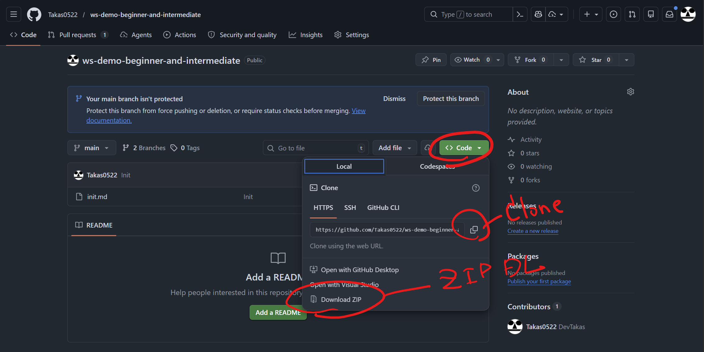
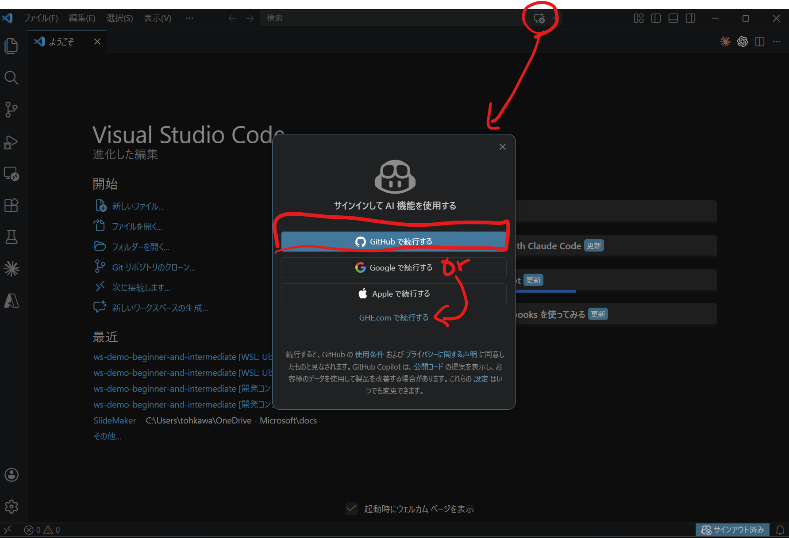
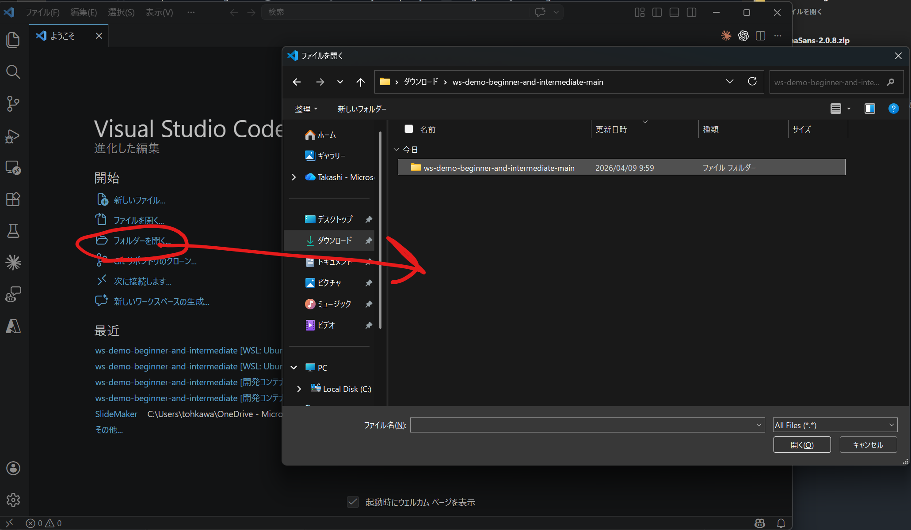
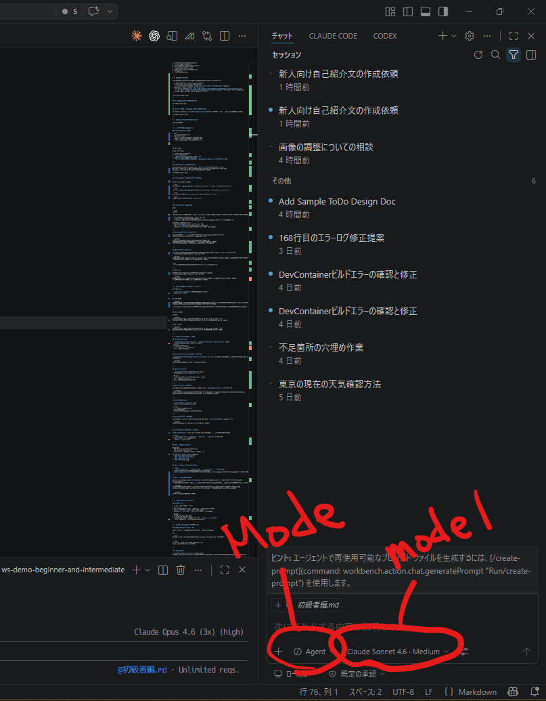
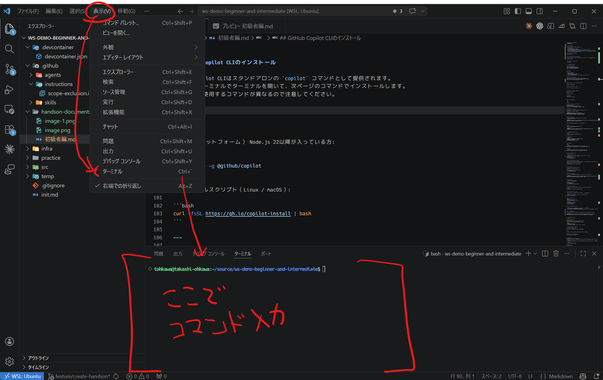
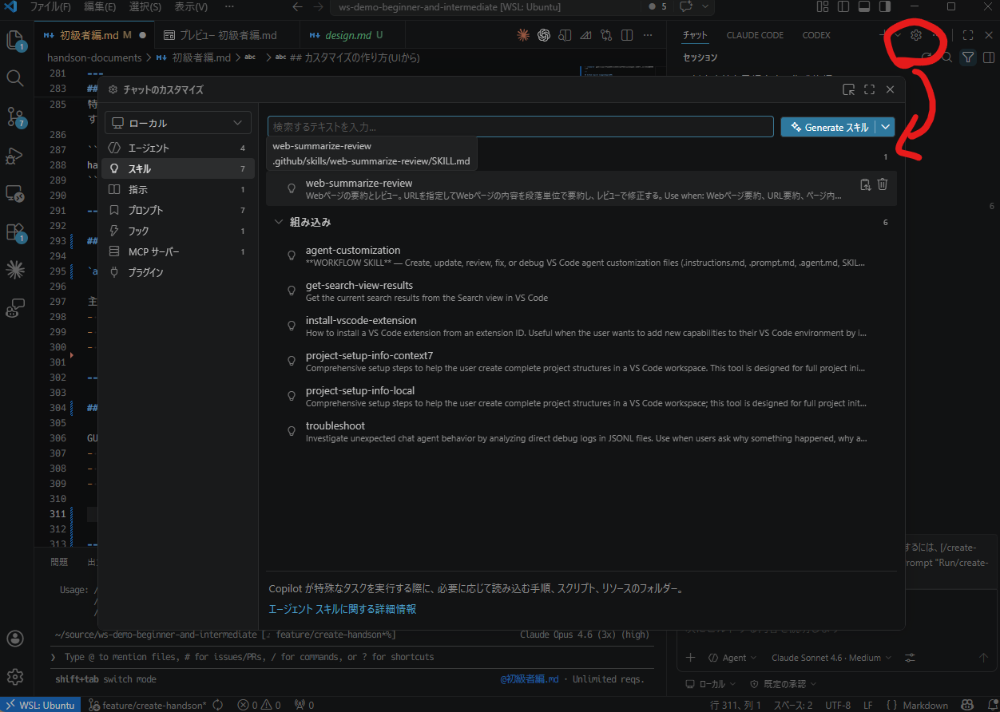
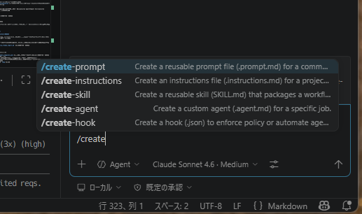

<style>
section.intro  { box-shadow: inset -10px 0 0 0 #B0BEC5; }
section.phase0 { box-shadow: inset -10px 0 0 0 #78909C; }
section.phase1 { box-shadow: inset -10px 0 0 0 #42A5F5; }
section.phase2 { box-shadow: inset -10px 0 0 0 #66BB6A; }
section.phase3 { box-shadow: inset -10px 0 0 0 #FFA726; }
section.phase4 { box-shadow: inset -10px 0 0 0 #AB47BC; }
section.phase5 { box-shadow: inset -10px 0 0 0 #26C6DA; }
section.phase6 { box-shadow: inset -10px 0 0 0 #5C6BC0; }
section.phase7 { box-shadow: inset -10px 0 0 0 #EF5350; }
section.phase8 { box-shadow: inset -10px 0 0 0 #8D6E63; }
</style>

<!-- class: intro -->
# GitHub Copilot 初級者編

ハンズオン資料

---

## 今日の流れ

0. 話している間に
1. GitHub EnterpriseとGitHub Copilot
2. 基本操作と最初の会話と設定
3. コードや文章の補完とAgentモードの活用
4. GitHub Copilotのカスタマイズ
5. CLIでのGitHub Copilotの活用
6. GitHub Copilotでのブラウザ操作作業
7. 業務での活用
8. まとめと次のステップ

---

<!-- class: phase0 -->
# 0. 話している間に準備

下記お話している間に準備お願いします（あとでチャット欄に貼っておきます）

- VS Codeのインストール（VS Code入ってない人）
  - https://code.visualstudio.com/download
  - またはコマンドプロンプトで `winget install Microsoft.VisualStudioCode` (Windows)
- ハンズオン資料のクローン、またはダウンロード
  - コマンドプロンプトで `git clone https://github.com/Takas0522/ws-demo-beginner-and-intermediate.git`
  - または `https://github.com/Takas0522/ws-demo-beginner-and-intermediate` からZIPでダウンロードして展開
  - 利用可能であればGitHub Codespacesでの利用も可能
---



---

## VS CodeでGitHubにログインしておく



---

## 今回のワークショップのディレクトリを開いておく

コマンドプロンプトで `cd ws-demo-beginner-and-intermediate` してから `code .` でVS Codeで開くでもよい。



---

<!-- class: phase1 -->
# 1. GitHub EnterpriseとGitHub Copilot

別スライドで実施

---

<!-- class: phase2 -->
# 2. 基本操作と最初の会話と設定

## GitHub Copilotの基本操作

- model
  - 使用するAIモデルを選択
- チャットのモード
  - Ask: 質問や指示を入力して回答や提案を得る
  - Agent: Copilotが自動的にタスクを実行する
  - Plan: Copilotが実行前にタスク計画を立てる

---



---

## 最初の会話

model: GPT-5 mini

1. GitHub Copilotを起動する
2. Askモードで質問する
  - `Webで現在の東京の天気を確認できますか`
3. Agentモードでタスク実行を依頼する
  - `確認した天気の情報などを要約して temp/weather_summary.txt に保存してください`

---

## GitHub Copilot CLIのインストール

GitHub Copilot CLIはスタンドアロンの `copilot` コマンドとして提供されます。
表示(V)→ターミナルでターミナルを開いて、次ページのコマンドでインストールします。
環境により使用するコマンドが異なるので注意してください。



---

## GitHub Copilot CLIのインストール（続き）


下記コマンドのいずれかを実行

```bash
npm install -g @github/copilot  #npm（全プラットフォーム） Node.js 22以降が入っている方
```
```bash
curl -fsSL https://gh.io/copilot-install | bash # Linux / macOSでcurlが利用可能な方
```
```bash
brew install copilot-cli # Homebrewが利用可能な方（macOS / Linux）
```
```bash
winget install GitHub.Copilot # Windowsの方
```

---

## GitHub Copilot CLIでの会話

起動:

```bash
copilot
```
※Windowsの場合再起動しないと `copilot` コマンドが認識されない場合があります（ここで5~10分ほど待ちます。待っている間に色々触ってみましょう）

- 初回起動時は未ログインなので `/login` で認証。
- `/model` でモデルの確認と変更が可能。
- `/research` でコードベース、関連リポジトリ、ウェブ上の情報に基づいてレポートを生成します

---

## GitHub Copilot CLIでの会話(続き)

3つのインタラクティブモード:
- ask/execute（デフォルト）: 依頼をそのまま実行
- plan: `Shift+Tab` で切り替え、計画を確認してから進行
- autopilot: `Shift+Tab` で切り替え、確認を減らして一気通貫で実行

---

## Pythonのインストール（uvベース）

環境競合を避けるため uv で構築しますインストール方法はCopilotに確認します。
以降の動作はmodel:Claude Sonnet 4.6で実施します。

```markdown
Pythonが利用できているか確認し利用できないようであれば
uvをインストールしPython3で開発するための環境を構築してください。
スクリプト開発とJupyter Notebookを使用した開発を行う想定です。
```

---

## Agent Browserモードの設定

VS Codeのブラウザ上でAIがWebの操作をすることが可能になるAgent Browserモードの導入を行います。
設定方法をCopilotに確認しながら設定を行います。

```markdown
Webで検索を行いVS Codeのweb apps with browser agent toolsを有効にする方法を調査し、設定ができているか確認してください。
設定できていないようであれば設定を実施してください。
```

注意:
- 初回利用時に必要パッケージのインストール確認が出る場合があります

---

## NESの設定

NES（Next Edit Suggestion）は次編集候補を提案する機能です。
設定方法をCopilotに確認しながら設定を行います。

```markdown
WebでNES（Next Edit Suggestion）を有効にする方法を調査し、設定ができているか確認してください。
設定できていないようであれば設定を実施してください。
``` 

---

<!-- class: phase3 -->
# 3. コードや文章の補完とAgentモードの活用

## 文章の補完

- `practice/メール文章.md` の書きかけ文章を補完させる
- 人名を変更する(NES)

---

## 文章の生成

```markdown
新人さんに向けた自己紹介の文章を作成してください。お仕事、パーソナルなこと交えて少し詳細目にフレンドリーなテイストで作成してください。
不明瞭な部分あればask questionの機能をつかって確認してください。
```
※`ask question`はCopilotが質問をしてくる機能で、必要に応じて質問に答えることでより精度の高いアウトプットが得られます。

---

## コードの生成

Windows:

```markdown
practice/reports ディレクトリ内のファイルを X.md から XX.md へリネームする
PowerShellスクリプトを作成し、temp/rename_script.ps1 に保存して実行してください。
```

Linux / macOS:

```markdown
practice/reports ディレクトリ内のファイルを X.md から XX.md へリネームする
Bashスクリプトを作成し、temp/rename_script.sh に保存して実行してください。
```

---

<!-- class: phase4 -->
# 4. GitHub Copilotのカスタマイズ

## Custom Instructions

- `.github/copilot-instructions.md`, `.github/instructions/*.instructions.md` に記述
- リポジトリ全体に適用される共通ルールを定義
主な用途:
- コーディング規約の共有
- 使用言語やフレームワークの明示
- 回答言語やトーンの指定

---

## Custom Instructionsを変更して使用してみる

`/.github/instructions/scope-exclusion.instructions.md` の「使用者は日本語話者であるため、やりとりは日本語で行う。」を「使用者は関西人であるため、やりとりは関西弁で行う。」に変更してみる。

```markdown
このリポジトリで管理されているものについて教えて！
```

---

## Agent Skillsの利用

- `.github/skills/<skill-name>/SKILL.md` に定義
- 指示、手順、補助リソースをまとめて再利用

主な用途:
- レビューやドキュメント作成手順のテンプレート化
- チーム共通フローの再利用
- 特定タスク向けの指示パッケージ化

---

## Agent Skillsを使用してみる

特定のWebページの文章の要約と推敲を行うAgent Skill `web-summarize-review` が存在します。

``` markdown
https://github.blog/changelog/2026-04-03-gpt-5-1-codex-gpt-5-1-codex-max-and-gpt-5-1-codex-mini-deprecated/
このURLのWebページ内容を要約し、temp/summary.md に保存してください。
```

---

## Custom Agentsの利用

- `.github/agents/*.agent.md` に定義
- Chatのモードセレクタから呼び出し

主な用途:
- ロール別エージェントの作成
- ツールや制約の分離
- 共通コンテキストを持つ専用エージェント運用

---

## Custom Agentsを使用してみる

特定の文章のレビューを行うエージェントが存在します。`レビューエージェント` を指定します。

```markdown
handson-documents/初級者編.md をレビューしてください。
```

---

## VS Codeの組み込みの機能利用してカスタマイズする

`agent-customization` は VS Code のGitHub Copilotに組み込まれたスキルです。

主な機能:
- `.instructions.md` / `.prompt.md` / `SKILL.md` / `.agent.md` の作成・編集
- YAMLフロントマターの構文サポート
- `applyTo` 設定ガイダンス

---

## カスタマイズの作り方(UIから)

GUIで作成:
- Chatビューの Configure Chat（歯車）
- Chat Customizations editor
- Instructions / Prompts / Skills / Agents タブ



---

## カスタマイズの作り方(チャットから)

- `/init`
  - workspaceからインストラクションファイルを作成/更新する
- `/create-instruction` / `/create-prompt` / `/create-skill` / `/create-agent`
  - それぞれのタイプのカスタマイズを新規作成する
- `agent-customization`Skill  相談を行いながら作成することも可能なので雑に始めることもできる。



---

## カスタマイズを実施してみる

AIと相談しながら雑にカスタマイズを行っていきます（後工程の準備）
基本的に何かの作業をAIと一緒に行った後にSkill化することが殆どで、こういった使い方のほうが珍しいかもしれませんが。

``` markdown
Pythonのスクリプトを作成する際にベストプラクティスを用いて品質が高く安定して作成できるようにしたい。
Custom Instructions/Agent Skillのどれを使用するのが適切だろうか？あるいは双方使った方が良い？
```

``` markdown
おすすめの方法で作成してください。
```

---

<!-- class: phase5 -->
# 5. CLIでのGitHub Copilotの活用

## CLI会話モード

| モード | 切り替え方 | 概要 |
|---|---|---|
| ask/execute（デフォルト） | 起動直後 | タスクを伝えると即実行 |
| plan | `Shift+Tab` | 実行前に構造化計画を確認 |
| autopilot | `Shift+Tab` | 確認などを省略して一気通貫で実行 |

---

## モードの使い分けについて

- すぐ実行したい: ask/execute
- 事前に計画確認したい: plan
- スクリプトでワンショットで実行する場合: `copilot -p "プロンプト"`
  - CIの中に組み込んだりバッチで動かすときに利用

---

<!-- class: phase6 -->
# 6. GitHub Copilotでのブラウザ操作作業

## Webアプリケーションの構造分析

Agent Browserモードで実サイトを操作し、構造分析と作業を実施。

例:

```text
#browser https://kintaidev2bg67dr4wu5ck.z11.web.core.windows.net/ に移動して
```

```text
ID: user01 / PASS: pass1234でログインした後に
出勤ボタンがあるからそれを押下して
```
---

# Tips

- `#XXX` 機能でチャットに特定の情報を添付したりツールを呼び出すことができます。
  - #browser URL: ブラウザ操作の対象URLを指定しブラウザ情報をチャットに添付
  - #terminalSelection: ターミナルの選択行をチャットに添付
  - #terminalLastCommand: ターミナルの最後のコマンドをチャットに添付
- `#`を入力すると候補が表示されるため、利用可能な機能を確認しながら利用できます。

---

## 作業のSkill化

ブラウザ操作手順を再利用可能なものとして保存。
この時に`agent-customization`ビルトインスキルを利用して、プロンプトの内容や構成について相談しながら作成する。

``` markdown
ここまでの手順をパッケージングしたいんだけど、Custom AgentとAgent Skill、Custom Instructionsのどれが良いかな？
```

``` markdown
おすすめの方法で作成してください。
```
作成後
``` markdown
出勤の打刻よろしく。
```
※状態の保存を行っておらず出勤状態が保存されていないため退勤打刻は（おそらく）できないです。

---

<!-- class: phase7 -->
# 7. 業務での活用

## 調査とPowerPointの作成支援

GitHub Copilot CLIで調査(research)を行い、得られた情報をもとにPowerPointスライド作成のAgent Skillを利用して資料作成。

```markdown
/research 2025年～2026年のAI関連の技術トレンドを調査し、{業界}における影響や動向を分析してください。
調査結果は `temp/ai_trends_report.md` に保存してください。
```

---

ここからはVS Codeの利用。
```markdown
`practice/dark_modern_template.potx`に調査した内容をもとにスライドを作成してください。
下記の流れで作成されます
1. スライドの構造を分析しテンプレートで提供されているレイアウトを把握
2. 調査内容をもとにスライドの構成を考え、適切なレイアウトなども決定する。Yamlの構造化されたファイルで管理。
3. スライドを作成 `temp`に保存
```

``` markdown
ここまでの手順をパッケージして使いまわしたいのでSkill化してください。
```

---

## 既存資料の分析

PDF、Markdown、テキストを読み込ませ、要約・分析・追記事項の抽出。資料の作成。
GitHub Copilot CLIを利用して、資料の内容を分析し、要約や追記事項の抽出を行う。

```markdown
/research `/practice/analytics/data_sources.md` の中に記載されている内容とURLのWebページを分析して、内容を要約してください。
CSVなどの集計が行えるファイルは`temp/`にダウンロードして詳細な分析ができるようにしてください。
```

```markdown
分析した内容をもとに、{業界}における動向の情報をまとめたレポートを作成してください。
分析の際にCSVやExcelがあればその内容を分析して、レポートに反映します。
作成したレポートはPPTXでまとめて`temp/`に保存してください。
傾向や将来の予測を行う必要があればPythonのスクリプトを構築して実行してください。
```

---

## TeamsやSlackなどの外部ツールとの連携(中級者向けで詳細を実施・デモのみ)

Teamsの会話を要約して資料を作成する(デモ)

---

<!-- class: phase8 -->
# 8. まとめと次のステップ

## このハンズオンで学んだこと

- GitHub Copilotの基本操作（Ask / Agent / Plan）
- GitHub Copilot CLIと `copilot` コマンド
- 文章とコードの補完・生成
- Custom Instructions / Agent Skills / Custom Agents
- Agent Browserモードによるブラウザ操作
- 業務文書作成と分析への活用

業務の基本的なタスクでの活用と、単純作業の自動化のためのカスタマイズの方法を学びました。

---

## 次のステップ

- 実業務の小さなタスクから使い始める
- チームでCustom Instructions整備する
- 繰り返し作業をAgent Skillやプロンプトファイル化する
- 中級者編へ続く
  - CLI/MCPなどを利用した他サービスとの連携
  - スクリプトツールの作成、情報の解析
  - ハーネスエンジニアリング/仕様駆動/Planモードの活用
  - 直近数か月のアップデート内容の紹介
